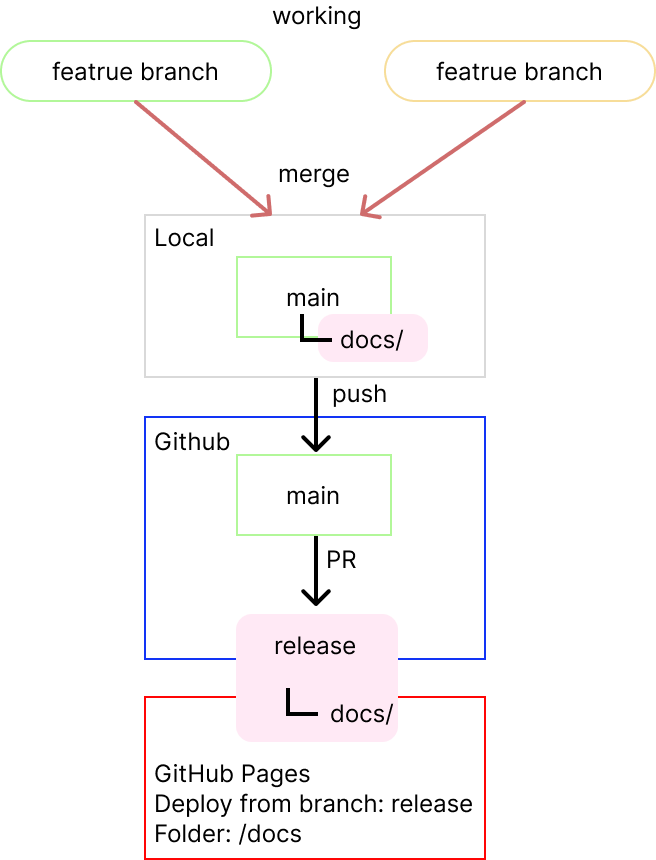

# Tech Stack & Architecture

leaf.loop is built with vanilla JavaScript and modular SCSS, organized around clear separation of concerns across structure, styling, rendering, and feature logic.

- HTML / SCSS / JavaScript
- Figma for layout prototypes
- Git & GitHub for version control and deployment
- GitHub Pages for hosting

---

## 1. Project Structure

Why the repository is organized this way.

### 1. HTML

- `index.html` (Site Entrance)
  The main entry point centers around the timer as its primary feature, using a grid layout with hover-based links embedded within the background image. Although there is no hamburger menu on this page, navigation paths to all sections are accessible within the visible screen.
- `gallery.html` (“A Little Bit of Tea from Around the World”)
  A responsive grid-based image display space featuring a clickable lightbox for enlarged viewing. Images are optimized for both WebP and AVIF formats.
- `universe.html`("A Little Bit of Distant Things")
  A web space inspired by the format of a picture-story show, where words and layered backgrounds shift over time. Visual changes respond to themes and selected text.
- `about.html`("About This Site")
  A descriptive section explaining the concept of leaf.loop. Text length is adjusted between mobile and desktop versions to improve scrolling rhythm and readability.
- `recipes.html` (“A Little Bit of Delicious Food”)
  A client-side rendered recipe application built with vanilla JavaScript. Uses `js/data/recipesData.js` as a data source.
  Implements client-side rendering based on URL query parameters.

### 2. SCSS Structure

The styling system is organized into layered directories for clarity and scalability.

#### /scss/components

Reusable UI components:

- `menu-drawer.scss` — Navigation drawer component
- `timer-mini.scss` — Shared mini timer component
- `decor-clock.scss` — Decorative clock
- `info.scss` — Help cards and auxiliary UI
- `scrim.scss` — Overlay layer for drawer interactions
- `page-header.scss` — Page header component
- `_timer.scss` — Hero timer styling

#### /scss/core

Global foundations and shared tokens:

- `variables.scss` — Shared SCSS variables
- `base.scss` — CSS custom properties (`--tokens`)
- `timer.vars.scss` — Mini timer–specific variables
- `a11y.scss` — Accessibility rules and `prefers-reduced-motion` settings

#### /scss/pages

Page-specific layouts:

- `_hero.scss` — Hero layout
- `_gallery.scss` — Gallery layout
- `_universe.scss` — Universe page entry point (`@use` only)
  - `universe/_index.scss` — SCSS module forwarding (`@forward`)
  - `universe/_tokens.scss` — Universe-specific design tokens
  - `universe/_animations.scss` — Centralized `@keyframes` definitions
  - `universe/_base.scss` — Page layout structure
  - `universe/_interludes.scss` — Chapter title styling
  - `universe/_chapters.scss` — Word sequence styling
- `_about.scss` — About page layout
- `_recipe.scss` — Recipe detail layout
- `_recipes.scss` — Recipe list layout

---

### 3. JavaScript Modules

The JavaScript architecture follows modular separation by responsibility.

#### Core

- `main.js` — Application entry point. Handles initial setup and orchestration of shared UI logic. Designed for extensibility through additional module imports.
- `site-menu.js` — Controls global menu drawer behavior.
- `help.js` — Manages help card interactions and guidance logic.

#### Data

- `data/creativeLogData.js` — Data source for creative log entries.
- `data/recipesData.js` — Data source for recipe content.

#### Pages

- `pages/creativeLogPage.js` — Layout and logic for the creative log page.
- `pages/recipesPage.js` — Structure and interactions for the recipe page.

#### Rendering

- `render/renderRecipes.js` — Rendering logic for recipe components.

#### Features / Effects

- `word_old.js` — Controls timed word transitions and theme switching on the Universe page.
- `gallery.js` — Implements lightbox interactions.
- `timer-base.js` — Core logic for timer and mini timer functionality.
- `clock.js` — Decorative animated clock component.
- `hero.js` — Handles hero video playback behavior.

## 2. Folder Responsibilities

Role and responsibility of each directory.

### root

- **styles/**
  Compiled CSS files used by the site.

- **assets/**
  Static assets such as images and videos.

- **docs/**
  Public files served by GitHub Pages.

- **js/**
  JavaScript currently used by the site.

- **\_archive/**
  Archived files kept for reference.

- **\_desk/**
  Workspace for temporary notes and working files.

## 3. Deployment Flow

How the site is deployed to GitHub Pages.

The project is deployed via GitHub Pages.

The public `docs/` directory is kept up to date, and direct pushes to the release branch are avoided.

Changes are developed in working branches and merged via pull requests to maintain version control clarity.

## 4. Branch Strategy

The repository uses a simple branching model.

- **feature/**
  Used for experimenting or developing new features.

- **main**
  Integration branch for development.

- **release**
  Production branch used for GitHub Pages deployment.

Workflow:

1. Work on a `feature/*` branch.
2. Merge changes into `main`.
3. When ready for release, create a Pull Request from `main` to `release`.

---

Return to [README](./README.md)
