# 📁 使用素材一覧（assets_credit.md）

本プロジェクトで使用している画像・動画・アイコン等の出典情報を記録しています。

---

## 🖼 画像 / Images

| ファイル名           | 出典サイト                                                                                                                                                                                                | 作者名・ID                                                                                                                                                        | ライセンス                | メモ（使用箇所）                                                                                                                                                                                                                                            |
| -------------------- | --------------------------------------------------------------------------------------------------------------------------------------------------------------------------------------------------------- | ----------------------------------------------------------------------------------------------------------------------------------------------------------------- | ------------------------- | ----------------------------------------------------------------------------------------------------------------------------------------------------------------------------------------------------------------------------------------------------------- |
| hero-bg.jpg          | 　[Pexels での Taryn Elliott による動画](https://www.pexels.com/ja-jp/video/5835661/)                                                                                                                     | Taryn Elliott                                                                                                                                                     | Free                      | 動画の先頭をスクリーンショットしてモバイルや遅い回線のための hero セクションの背景静止画（poster）として使用                                                                                                                                                |
| 001.webp 001.avif | [Unsplash の Timothy Newman が撮影した写真](https://unsplash.com/photos/green-plant-in-close-up-photography-_ZH-GRbh0iE)                                                                                  | [Timothy Newman](https://unsplash.com/photos/green-plant-in-close-up-photography-_ZH-GRbh0iE?utm_source=unsplash&utm_medium=referral&utm_content=creditCopyText)  | Unsplash ライセンスで無料 | ギャラリー 1 枚目 茶の木、葉っぱの近距離撮影 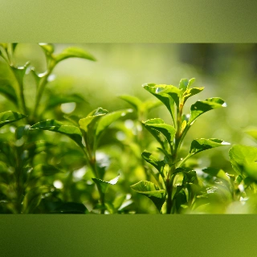                                                                                                   |
| 002.webp 002.avif | [Unsplash の Na visky が撮影した写真](https://unsplash.com/photos/white-ceramic-teacup-on-brown-wooden-table-3hRRT4qztzs)                                                                                 | [Na visky](https://unsplash.com/photos/white-ceramic-teacup-on-brown-wooden-table-3hRRT4qztzs?utm_source=unsplash&utm_medium=referral&utm_content=creditCopyText) | Unsplash ライセンスで無料 | ギャラリー 2 枚目 茶色の木製テーブルに白いセラミックのティーカップ 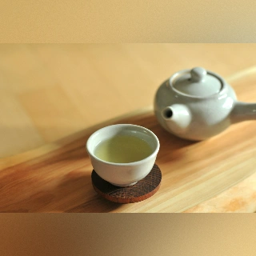                                                       |
| 003.webp 003.avif | [Unsplash の Matcha & CO が撮影した写真](https://unsplash.com/photos/green-powder-herbs-near-scope-TIxtjq1qdRs)                                                                                           | [Matcha & CO](https://unsplash.com/@matchaandco)                                                                                                                  | Unsplash ライセンスで無料 | ギャラリー 3 枚目 green powder herbs near scope 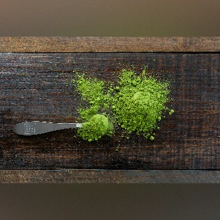                                                                                             |
| 004.webp 004.avif | [Unsplash の Alice Pasqual が撮影した写真](https://unsplash.com/photos/six-condiments-on-jars-2yZxFxn1938)                                                                                                | [Alice Pasqual](https://unsplash.com/ja/@stri_khedonia?utm_content=creditCopyText&utm_medium=referral&utm_source=unsplash)                                        | Unsplash ライセンスで無料 | ギャラリー 4 枚目 six condiments on jars 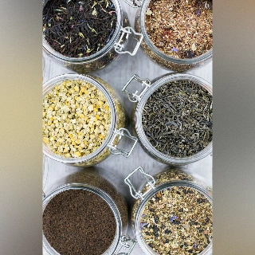                                                                                                           |
| 005.webp 005.avif | [Unsplash の MD. Mehedi Hassan Sharif が撮影した写真](https://unsplash.com/photos/a-close-up-of-a-white-flower-with-green-leaves-Zqai2COyXBw)                                                             | [MD. Mehedi Hassan Sharif](https://unsplash.com/ja/@sharif647?utm_content=creditCopyText&utm_medium=referral&utm_source=unsplash)                                 | Unsplash ライセンスで無料 | ギャラリー 5 枚目 a close up of a white flower with green leaves 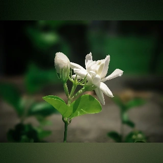                                                           |
| 006.webp 006.avif | [Unsplash の Merve Sehirli Nasir が撮影した写真](https://unsplash.com/photos/stainless-steel-round-container-with-purple-flowers--feoAbhn8Pc)                                                             | [Merve Sehirli Nasir](https://unsplash.com/ja/@32steps?utm_content=creditCopyText&utm_medium=referral&utm_source=unsplash)                                        | Unsplash ライセンスで無料 | ギャラリー 6 枚目 stainless steel round container with purple flowers 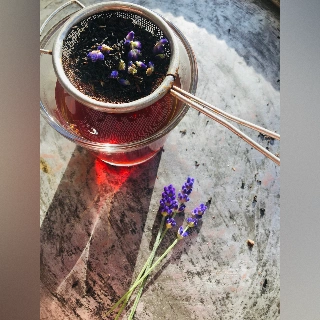                                                 |
| 007.webp 007.avif | [Unsplash の Helen Van が撮影した写真](https://unsplash.com/photos/a-glass-of-lemonade-with-ice-and-lemon-slices-rJWJLdOgLzA)                                                                             | [Helen Van](https://unsplash.com/ja/@uynnha?utm_content=creditCopyText&utm_medium=referral&utm_source=unsplash)                                                   | Unsplash ライセンスで無料 | ギャラリー 7 枚目 a glass of lemonade with ice and lemon slices 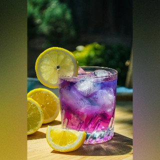                                                             |
| 008.webp 008.avif | [Unsplash の TeaCora Rooibos が撮影した写真](https://unsplash.com/photos/brown-wooden-round-bowl-on-white-sand-Mp2HHad-QF0)                                                                               | [TeaCora Rooibos](https://unsplash.com/ja/@teacora?utm_content=creditCopyText&utm_medium=referral&utm_source=unsplash)                                            | Unsplash ライセンスで無料 | ギャラリー 8 枚目 brown wooden round bowl on white sand 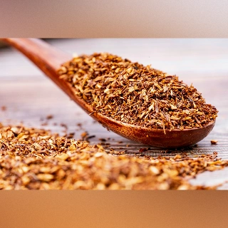                                                                             |
| 009.webp 009.avif | [Unsplash の Emily Wade が撮影した写真](https://unsplash.com/photos/a-table-topped-with-bowls-of-food-and-a-cup-of-coffee-wCeYehOEJ48?utm_source=unsplash&utm_medium=referral&utm_content=creditCopyText) | [Emily Wade](https://unsplash.com/@emily_wade?utm_source=unsplash&utm_medium=referral&utm_content=creditCopyText)                                                 | Unsplash ライセンスで無料 | ギャラリー 9 枚目 黒いポットとミルクティのカップ。手前にスパイスが数種類 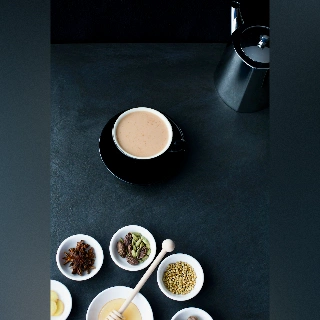 |
| 010.webp 010.avif | [Unsplash の Sergey N が撮影した写真](https://unsplash.com/photos/selective-focus-photography-of-cup-of-bowl-beside-brown-teapot-szmge3ABe94)                                                             | [Sergey N](https://unsplash.com/ja/@tipod?utm_content=creditCopyText&utm_medium=referral&utm_source=unsplash)                                                     | Unsplash ライセンスで無料 | ギャラリー 10 枚目 selective focus photography of cup of bowl beside brown teapot 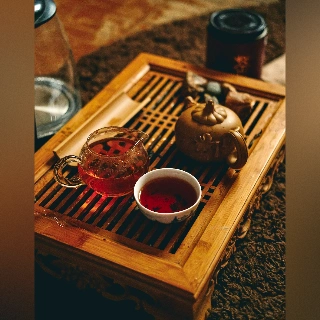                          |
| 011.webp 011.avif | [Unsplash の Tuyen Vo が撮影した写真](https://unsplash.com/photos/white-ceramic-mug-with-brown-and-green-leaves-6LjKkxNslLY)                                                                              | [Tuyen Vo](https://unsplash.com/ja/@bitu2104?utm_content=creditCopyText&utm_medium=referral&utm_source=unsplasht)                                                 | Unsplash ライセンスで無料 | ギャラリー 11 枚目 花びらの中国茶 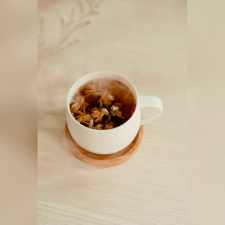                                                                                                                          |
| 012.webp 012.avif | [Unsplash の Jelleke Vanooteghem が撮影した写真](https://unsplash.com/photos/pastries-display-on-rack-qfRsevOtQXE)                                                                                        | [Jelleke Vanooteghem](https://unsplash.com/ja/@ilumire?utm_content=creditCopyText&utm_medium=referral&utm_source=unsplash)                                        | Unsplash ライセンスで無料 | ギャラリー 12 枚目 アフタヌーンティー 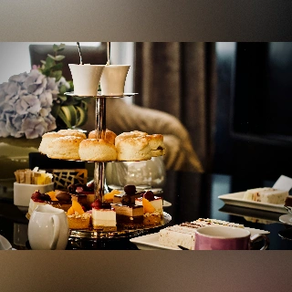                                                                                                                  |
| 013.webp 013.avif | [Unsplash の Duong Ngan が撮影した写真](https://unsplash.com/photos/a-person-pours-tea-from-a-teapot-into-small-plates-Yh1jarxw468)                                                                       | [Duong Ngan](https://unsplash.com/@nganduong93?utm_source=unsplash&utm_medium=referral&utm_content=creditCopyText)                                                | Unsplash ライセンスで無料 | ギャラリー 13 枚目 月餅と茶器に注がれるお茶 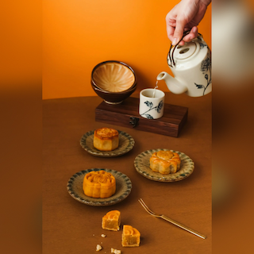                                                                                                      |
| 014.webp 014.avif | [Unsplash の MeSSrro が撮影した写真](https://unsplash.com/photos/a-cup-of-tea-sitting-on-top-of-a-wooden-table-svBi79E4viI)                                                                               | [MeSSrro](https://unsplash.com/ja/@messrro?utm_content=creditCopyText&utm_medium=referral&utm_source=unsplash)                                                    | Unsplash ライセンスで無料 | ギャラリー 14 枚目 A cup of tea sitting on top of a wooden table 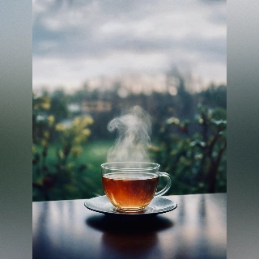                                                            |
| 015.webp 015.avif | [Unsplash の Anita Austvika が撮影した写真](https://unsplash.com/photos/a-cup-of-tea-sits-on-a-table-bVELgdlCfIw)                                                                                         | [Anita Austvika](https://unsplash.com/ja/@anitaaustvika?utm_content=creditCopyText&utm_medium=referral&utm_source=unsplash)                                       | Unsplash ライセンスで無料 | ギャラリー 15 枚目 a cup of tea sits on a table 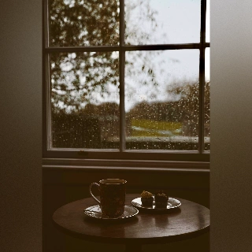                                                                                              |
| 016.webp 016.avif | [Unsplash の Ewien van Bergeijk - Kwant が撮影した写真](https://unsplash.com/photos/a-person-holding-a-coffee-mug-with-a-flower-in-it-LIbXABpmzfc)                                                        | [Ewien van Bergeijk - Kwant](https://unsplash.com/ja/@btwien?utm_content=creditCopyText&utm_medium=referral&utm_source=unsplash)                                  | Unsplash ライセンスで無料 | ギャラリー 16 枚目 a person holding a coffee mug with a flower in it 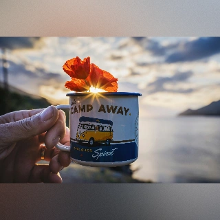                                                    |
| 017.webp 017.avif | [Unsplash の Vivek Kumar が撮影した写真](https://unsplash.com/photos/green-fields-JS_ohjocm00)                                                                                                            | [Vivek Kumar](https://unsplash.com/ja/@qriusv?utm_content=creditCopyText&utm_medium=referral&utm_source=unsplash)                                                 | Unsplash ライセンスで無料 | ギャラリー 17 枚目 green fields 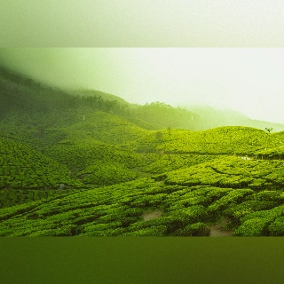                                                                                                                              |

## 🎞 動画 / Videos

| ファイル名                     | 出典サイト                                                                          | 作者名・ID    | ライセンス | メモ（使用箇所        |
| ------------------------------ | ----------------------------------------------------------------------------------- | ------------- | ---------- | --------------------- |
| 5835661-sd_960_540_25fps.mp4   | [Pexels での Taryn Elliott による動画](https://www.pexels.com/ja-jp/video/5835661/) | Taryn Elliott | Free       | hero セクションの背景 |
| 5835661-hd_1920_1080_25fps.mp4 | [Pexels での Taryn Elliott による動画](https://www.pexels.com/ja-jp/video/5835661/) | Taryn Elliott | Free       | hero セクションの背景 |

---

## 🎞 音 / Sounds

| ファイル名 | 出典サイト | 作者名・ID          | ライセンス | メモ（使用箇所） |
| ---------- | ---------- | ------------------- | ---------- | ---------------- |
| alarm.mp3  | 自作       | 自分（GarageBand ） | -          | タイマー完了通知 |

## 🎨 フォント・アイコン / Fonts 　 Icons

本プロジェクトで使用しているフォントとアイコンの出典・ライセンスを記録します。
（各素材はライセンス条項に従って使用しています。取得日は記録目的です。）

## Fonts（Google Fonts / Web 配信）

- **Zen Maru Gothic**

  - Variants: `Regular`
  - Source: https://fonts.google.com/specimen/Zen+Maru+Gothic
  - License: **SIL Open Font License 1.1** — https://scripts.sil.org/OFL
  - Obtained: 2025-09-19

- **Zen Kaku Gothic New**

  - Variants: `Regular`, `Bold`
  - Source: https://fonts.google.com/specimen/Zen+Kaku+Gothic+New
  - License: **SIL Open Font License 1.1** — https://scripts.sil.org/OFL
  - Obtained: 2025-09-19

- **Kiwi Maru**

  - Variants: `Regular`
  - Source: https://fonts.google.com/specimen/Kiwi+Maru
  - License: **SIL Open Font License 1.1** — https://scripts.sil.org/OFL
  - Obtained: 2025-09-19

- **M PLUS 1p**

  - Variants: `Regular`
  - Source: https://fonts.google.com/specimen/M+PLUS+1p
  - License: **SIL Open Font License 1.1** — https://scripts.sil.org/OFL
  - Obtained: 2025-09-19

- **Zen Kurenaido**
  - Variants: `Regular`
  - Source: https://fonts.google.com/specimen/Zen+Kurenaido
  - License: **SIL Open Font License 1.1** — https://scripts.sil.org/OFL
  - Obtained: 2025-12-08

> Notes: Google Fonts 経由で配信。ローカル同梱・サブセット化なし（現状）。

---

## Icons（Material Symbols）

### 現在使用中（SVG 個別読込）

- Source: https://fonts.google.com/icons
- License: Apache License 2.0 — https://www.apache.org/licenses/LICENSE-2.0
- Use: SVG を個別に取得し ``／`<svg>` で使用
- Used icon names:
  `play_circle`, `stop_circle`, `refresh`, `volume_off`,
  `help`, `close`, `sound_sampler`, `mobile_vibrate`, `toast`
- Obtained: 2025-12-08
  > Notes: 個別 SVG 化により読み込みの制御性・可読性向上

---

### 過去の方式（Static icon font）

- Source: https://fonts.google.com/icons
- License: Apache License 2.0 — https://www.apache.org/licenses/LICENSE-2.0
- Fonts: `<link href="https://fonts.googleapis.com/...">` で読み込み（Google Fonts）。
- Use: `icon_name` 形式で利用
- Period: 2025-09-19〜2025-12-08 頃

---

## ウェブツール

1. [Squoosh](https://squoosh.app/)
2. [正方形画像](https://squareanimage.com/ja/)

- Obtained: 2025-12-08

---

## Change Log

- 2025-12-08: **第 2 版作成**
  - Material Symbols を Static font → SVG 方式に変更（現行方式へ）
  - icon name を一覧化し明確化
  - ギャラリー画像追加
- 2025-09-19: 初版作成（動画、音、Google Fonts 4 ファミリー、Material Symbols 記載）

---

## 📝 備考 / Notes

- ライセンスが CC0 / Free でも、公開物（GitHub 等）には出典元を記載する方針。
- `.assets_credit.md` は開発中でも随時追記・更新。
